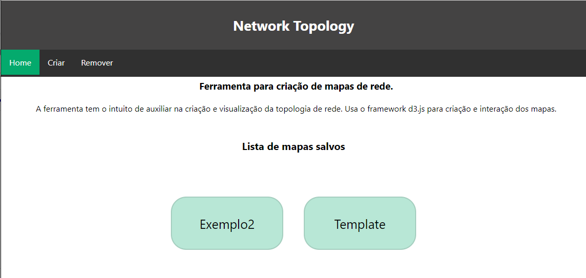
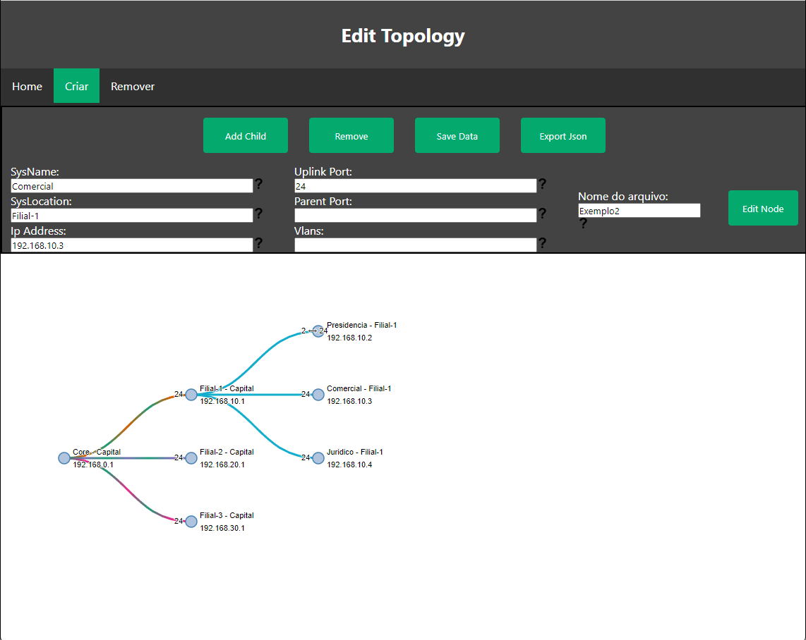

# NetworkTopoly

Ferramenta desenvolvida para auxiliar na criação de mapas da topologia de rede.

A página inicial da ferramenta mostra todas as redes mapeadas.

No Menu de navegação contém 4 opções:

    - Home -> Página inicial da aplicação. Lista todas as tipologias criadas. Ao clicar você é redirecionado à página que desenha a topologia da rede.

    - Criar -> Redireciona para a parte de criação da topologia de rede. Usa um template base contendo somente um nó pai e um nó filho.

    - Desenhar -> Desenha a topologia de rede selecionada. O desenho possui nós (os círculos) e links (as linhas que conectam os nós). Cada nó representa um ativo de rede, por sua vez esse ativo pode receber algumas configurações.
        
        Nome do ativo.
        Localização do ativo.
        Endereço ip.
        Porta de Uplink.
        Porta do no pai que liga ao uplink.
        Id das Vlans que chegam a esse ativo.

        Caso possua mais de uma vlan, adicioná-las em forma de lista, separadas por vírgula.
        
        A legenda mostra a cor correspondente ao vlandID.

        É possível editar uma topologia clicando no botão de editar, que encaminha para a tela de criação, porém usando como base o arquivo que estava na visualização. Para realizar a edição dos link é necessário clicar no nó a ser editado, após selecionado, o menu de edição ira aparecer juntamente com as opções a cima. Após adicionar a informação clique em `Edit Node` para visualizar a edição. Uma vez que toda a edição estiver concluída, basta clicar em Save Data para que as alterações sejam aplicadas ao arquivo que deseja a topologia.

        O botão Salvar PDF gera um documento do tipo pdf contendo o svg da topologia de da rede.
            Na pasta imgs_readme possui um exemplo de pdf exportado.

    - Remover -> Lista todos os arquivos e permite que possam ser apagados do diretório arquivos_json

### Modo de instalação
    
1- Baixe o projeto.

    git clone https://github.com/FerndWehbe/NetworkTopoly

ou 

    Faça o download pela interface grafica de descompacte o arquivo.
        
2- Entre no diretorio do projeto e crie um ambiente virtual.

    python3 -m venv venv
    
    
***Necessário sempre que o projeto for executado.***       

3- Ative o virtualenv.

Windows
    
    ./venv/Scripts/Activate
    
Linux
    
    source ./venv/bin/active
        
4- Rode o projeto.

    python main.py
    
    
Assim que o projeto estiver rodando basta acessa-lo no navegador pelo endereço:
    
    http://127.0.0.1:8000
